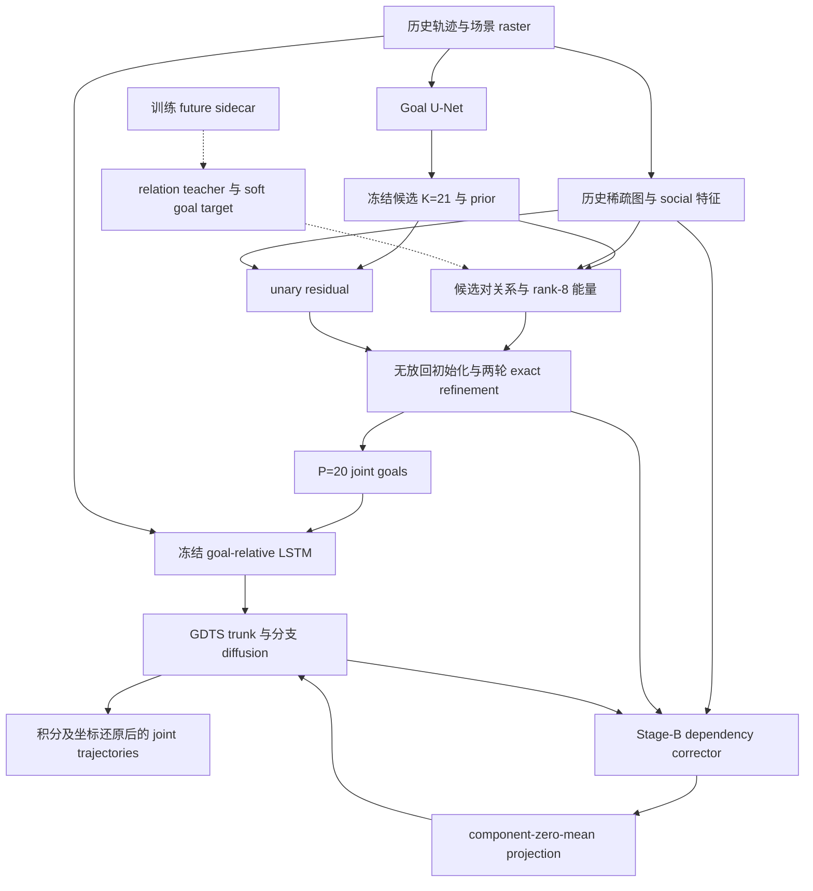

# RSJG / Joint Dependency V2 独立审查报告

审查对象：`research/joint-dependency-v2-clean`，HEAD `cfa3dd2e55141de19cd5ad0de21793a3285b6c25`。审查日期：2026-10-03。SDD 训练代码：`04fcaa4114a7fd695ede82fabd87adab3ff44781`。

证据等级：**CONFIRMED**＝源码或已提交 artifact 直接支持；**LIKELY**＝机制明确但尚缺实际运行反事实；**OPEN**＝缺少必要证据；**FALSE ALARM**＝检查后不成立。Artifact 中的历史运行结果不等同于本轮重新执行验证。所有误差指标均 lower-is-better。

审查边界：本轮只读取仓库、论文、配置、测试和已提交结果；未修改仓库、训练、创建 PR 或改变冻结权重。报告是新建审查产物。12 个指定文档按顺序读取，均存在。不存在 `exact_assignment.py`；实际实现为 `exact_lexicographic_assignment.py`。训练代码至 HEAD 的差异仅增加两份状态/架构文档，未改变执行源码。

本轮验证：执行 6 个 JMM 原测试函数的断言主体，借助最小 `approx/raises` 支持而非 pytest runner；通过。抽取未经改写的纯 Python 整数 Hungarian 核心，在 900 个小规模、slot-invariant mask 问题上与穷举最优值比较；通过。抽取 `_evaluate_epoch`、去除 `torch.no_grad` 装饰器并使用空 evaluator，重放五次种子路由，得到 `[2035,2035,2035,2035,2035]`。校验 V2-A manifest 中两份 canonical config 和两个核心源码 SHA256；均匹配。环境无 PyTorch/pytest，未运行完整 pytest、模型前后向或 CUDA/BF16；官方 JMM 原始数据文件、三份冻结权重、实际 40GB 缓存不在检出目录中。不得将历史文档中的 492 PASS 写成本轮验证。

正文 `[E01]` 等链接指向固定 HEAD 源码；附录逐项提供文件、函数/类和行号。

## 1. Executive Summary

**工程有明确的冻结边界、身份契约和审计积累，但尚不能认定整个运行链路已经可靠复现。Stage-A 值得保留，Stage-B V2-A 值得保存为受控对照，暂不值得凭现有证据升级为最终主模型。SDD 可以继续当前 baseline，但尚不具备“完全复现论文 7.42/11.57”的证明条件。**

Stage-A 确实引入候选对依赖和多人的共同 sample 列，不只是每人单独重排：动态关系为 `[E,K,K,4]`，关系能量参与每个 agent 的邻居条件分数，最终同一列形成 joint world。不过“学习到物理关系语义”“准确采样完整 joint posterior”“严格 clean generalization”均未建立。[E04][E08][E09][E10]

V2-A 相比配对 Stage-A，minADE/minFDE/JADE 分别恶化 0.636%/0.259%/0.429%，JFDE/RME 改善 0.533%/0.156%。它主要恢复 V1 引入的 marginal 损失，并验证去除分量共同残差的价值；不是全面超过 Stage-A 的证据。五个推理种子也不是五个独立训练种子。[E38]

最高优先级三个问题：

1. **HIGH，CONFIRMED：普通 JDV2 `test()` 重复同一 seed。** `num_test_runs=5` 不自动产生五个独立结构化评估种子。独立审计工具显式传 seed，其历史五种子表不能被此问题一概否定。[E01][E02][E39]
2. **HIGH，CONFIRMED 路由 / LIKELY 数值后果：canonical Stage-A 仍执行 frozen corrector。** `joint_goal` 仅冻结参数，不关闭推理；配置 corrector=true、projection=none，E>0 时进入零残差加法。BF16 下是否改变实际 checkpoint 输出，必须配对验证。现有 Stage-B 身份测试的 Stage-A reference 则显式关闭 corrector，存在参考路径不一致风险。[E03][E05][E06][E07][E40]
3. **HIGH，CONFIRMED：训练 resume 不恢复随机状态，且 best/numbered 与 last 的 scheduler 边界不同。** 现有 resume 修复保证 progress/best/stopping state，不能证明随机训练轨迹等价；从 numbered 恢复还可能落后一轮 LR step。[E16][E17][E18][E19][E20]

最大协议风险是 mirrored validation/test：模型选择后再次报告相同内容，不能称 independent held-out。SDD 同样明确 `validate_on_test`。[E37][E25]

## 2. Reconstructed Architecture

记号：N 为窗口总 agent 数，C 为打包场景数，E 为无向稀疏边数，To=8，Tf=12，K=21，P=20，M=4，R=8，h×w 为下采样 raster。baseline batch=64 是 fragment packing；JDV2 使用同步 scene-window 语义，不应将两者等同。

### 2.1 端到端数据流

虚线为 Stage-A 训练监督，不在部署路径；B/Q 只应作为 Stage-B correction 路径理解。**源码例外**：canonical Stage-A 也传递 dependency state 并进入 corrector gate，详见 P02，不能直接把设计图当作执行证据。baseline 则直接 U-Net→TTST goals→LSTM→diffusion，不经过 H/R/A/S/B/Q。[E03][E04][E05]

### 2.2 三套状态

| 状态 | 训练/冻结范围 | 实际推理 |
|---|---|---|
| SDD GDTS baseline | Goal 150 epochs；fresh joint model 250 epochs，Goal/history/diffusion 联合训练 | independent；TTST；P=20；FP32；不构造 JDV2 |
| ETH Stage-A | strict_no_z epoch13；baseline 冻结；social/base relation/unary/dynamic/energy/teacher 为 Stage-A 学习模块 | K21→P20 exact persistent refinement；冻结 GDTS；canonical config 仍 corrector=true |
| ETH Stage-B V2-A | epoch5；Stage-A 与 GDTS 均冻结；仅 30,851 个 corrector 参数训练；projection 无参数 | t=30,25,20,15,10,5 correction；active agents 投影残差；E=0 literal bypass |

Stage-A SHA256=`699336d49aaecbccfaac8b44f00c0df5a73b521548fc29d3da37d071148fd5bb`；B=`e4c114c729ba8d75ac72fc7d41f0f05e790cf2aec7b5cade563ba792930c7b73`。这些是 manifest 声明值，当前没有权重文件，不能宣称本轮校验过其字节。[E37][E38]

### 2.3 逐模块结构、信息边界和风险

| 模块 | 输入→输出 shape | 信息/对称性/边界 | 判定及主要风险 |
|---|---|---|---|
| Goal U-Net | `[N,14,h,w]`＝6 场景通道+8 history maps→`[N,12,h,w]` raw logits | 共享卷积，各 agent 独立；推理只传 observed maps，future maps 为 BCE target；默认 DoubleConv 无 BN | CONFIRMED；保留所有12 future heatmaps，候选只取末通道；per-agent raster repeat 内存冗余。[E22][E23] |
| GDTS history LSTM | 每个 goal 的 `[N,8,8]`→`[N,256]`，context `[21,N,1,256]` | goal-relative 位置+历史动态；共享 LSTM；21 为20 branches+内部 trunk | CONFIRMED；不存在跨 agent attention。固定8步安全；variable-length `outputs[:,-1]` 不应扩展为已正确处理缺失历史。[E05][E24] |
| Diffusion Transformer | noisy increments `[N,12,2]`+context256+t→epsilon `[N,12,2]` | 2 层、4 heads、d_model512；attention 时间轴，不是多人轴；GDTS 本身不是 joint denoiser | CONFIRMED；dropout 由 `.eval()` 关闭；论文层数不同。[E22][E26] |
| Sparse graph | obs `[N,8,2]`+scene `[N]`→edges `[2,E]`、feat `[E,14]`、weight `[E]` | 历史 radius/TTC，dt=.4；scene 内连边、双向特征翻转；无可学参数 | CONFIRMED；E=0合法；radius6必须以米解释；SDD pixel baseline 尚未使用此图。[E27] |
| SocialMotionEncoder | obs+graph→`[N,128]` | GRU history+一层 gated 双向聚合；sum/归一化 aggregation 对 agent 重排等变；isolates 保留 temporal feature | CONFIRMED；FP32 index_add island；与 GDTS LSTM 功能有历史编码重叠，但专用于关系而非 generator context。[E28][E04] |
| Base RelationInference | h、edge feat→logits/prob `[E,4]` | 共享边网络，历史信息；反向特征一致性 | CONFIRMED；无标签保证4类是“避让/跟随”等物理类；E=0空tensor。[E29] |
| Dynamic relation | base logits+两端候选几何→`[E,21,21,4]` | endpoint距离、位移 cosine、formation变化、位移长度差；确实随 candidate pair 变化；候选轴重排等变 | CONFIRMED；几何交换两端不变，query无z轴；需避免把潜在模式解释为已识别物理语义。[E08] |
| Unary residual | h、候选 `[N,21,2]`、log prior `[N,21]`→score `[N,21]` | 共享候选 MLP；zero-init residual；invalid mask hard `-inf` | CONFIRMED；可独立改善 marginal ranking，是 relation/energy 归因的旁路；exact mask 联用缺陷见P03。[E30] |
| Low-rank energy | h、candidate、edge feat→L/R `[E,4,21,8]`→relation energy `[E,21,21,4]`→effective `[E,21,21]` | 正/反向共用编码；relation mixture 为 logsumexp(log p + energy) | CONFIRMED；每个模式底层rank8，混合后的effective matrix未必rank8；不可称全joint likelihood精确归一化。[E09] |
| Structured sampler | unary、graph、关系能量→IDs `[N,20]`、goals `[N,20,2]`、rel prob `[E,20,4]`、embedding `[E,20,16]` | 无放回初始化；20 slots injective；两轮同步；degree0保留初始化 IDs | CONFIRMED；20/20是20个不同候选而非覆盖全部21；不是独立 posterior draws；有two-cycle。[E10][E11] |
| Future teacher | future descriptor `[E,6]`→q(r) `[E,4]` | 仅训练；未来最小距离、时间、endpoint、formation；strict-no-z无scene posterior | CONFIRMED；q与p均接收KL梯度；模式可整体置换，语义不辨识。[E31][E12] |
| DependencyCorrector | noisy world velocity `[N,12,2]`、anchor、graph、relation `[E,16]`、t→delta `[N,12,2]` | 重构 noisy positions；双向edge messages+time FiLM；有真实跨agent输入；isolates精确零 | CONFIRMED；输出是map-increment epsilon修正，输入是world velocity，不要求二者单位相同；训练oracle branch与推理20 branches不同。[E32][E13] |
| Component projection | raw delta `[N,12,2]`→FP32同shape | 每个非孤立 connected component 逐time/coordinate去agent均值；isolates0；无参数 | CONFIRMED；理论为线性投影，FP32 component sum仅数值近零，非承诺任意规模bitwise sum=0。[E14] |

排列性质要区分层次：共享网络/聚合的确定性结构是等变；CPU/GPU浮点求和次序可能导致微小数值差；sampler tie 是分布 exchangeable。固定同一seed后重排 agent ID并重新生成 tie，不保证样本逐点相同；pathwise 检查必须一起搬运已有 R/noise，而非只搬输入。[E11][E41]

### 2.4 实际梯度路径

**SDD Goal stage**：raw logits→`BCEWithLogitsLoss`→Goal U-Net；只优化Goal，无history/diffusion。[E21][E23]

**SDD joint**：`L = L_diff + 20 L_GoalBCE`；U-Net从BCE学习；采样goal/context构造中的detach意味着不应宣称 diffusion 梯度穿过离散goal采样回传U-Net；history LSTM和diffnet从epsilon MSE学习。训练context使用GT goal，推理使用预测goal，是原GDTS的teacher-forcing差异；不等于部署看到GT。[E63]independent 分支硬编码1和20，与默认参数一致，但用户改 `lambda_goal/lambda_diff` 不改变独立baseline权重。[E15][E42]

**Stage-A strict-no-z**：soft GT goal target固定；`0.5 PL_post + 0.5 PL_prior + beta(progress) KL(q||p)`。两种PL对每个scene归一；KL按边均值，拥挤scene相对权重更高。prior PL：social→base/dynamic relation→effective energy，加unary→局部条件soft CE。posterior PL：teacher q替换关系混合权重，同一energy/unary；KL同时更新q和p，**q没有detach**，不是固定教师单向蒸馏。beta初期为0、随后warmup，属于设计，不是漏算loss。Stage-A不对离散sampler或冻结diffusion做端到端优化。[E12][E15][E43]

`dynamic_relation.relation_embedding [4,16]` 只用于 sampled selected relation embedding；A 的 full-pair PL/KL不使用它，故虽requires_grad且入optimizer，其 `.grad` 为None；B再冻结它。能量模块自身的 `[4,64]` relation embedding 是另一参数，有A损失梯度，不能混为一谈。此处首先是未使用可训参数/文档语义问题；随机basis可能足够让corrector读出relation，不等于已证明有害。[E08][E09][E43]

**Stage-B**：`no_grad` Stage-A产生P20 goals→每scene选GT endpoint oracle branch→冻结LSTM/diffnet→corrector→FP32 projection→epsilon MSE及relative-position loss→仅corrector optimizer。投影反向雅可比为component上的`I-11ᵀ/n`，消除共同方向梯度；relative difference对共同平移本来不敏感。diffusion loss只取active agents；E0 loss通过corrector参数构造可微零，避免backward无图。relative loss经epsilon→x0→累计位置，是有效梯度路径；已记录加权梯度范数约1.775%、cosine约.824，说明方向相关但权重贡献弱，不能把存在loss等同强优化目标。[E03][E13][E44]

冻结模块被训练模式覆盖后会恢复eval；diffnet positional/Transformer dropout部署时关闭，U-Net默认无BN，social默认dropout0。LSTM源码`F.dropout(training=True)`看似风险，但实际active调用keep_prob=1、p=0，本配置是FALSE ALARM。变量长度历史和将来修改keep_prob时需另测。[E24][E45]

## 3. Configuration-to-Execution Matrix

| 配置 | baseline 参数 | JDV2实例/Goal路径 | z/关系/能量 | corrector训练/推理 | sampler/RNG |
|---|---|---|---|---|---|
| independent + baseline（SDD） | trainable | 不构造JDV2 | 无 | 无 | 原TTST+GDTS；test不强制每次reseed |
| JDV2 all-off + baseline | 同legacy | 构造前passthrough gate；参数namespace同legacy | 四个关键flag全false | 无 | legacy；不能用joint_goal stage |
| strict_no_z Stage-A frozen config | frozen、eval | social/base/unary/dynamic/energy/teacher存在；无scene latent实例 | M4关系、rank8能量 | frozen；**true/none，E>0仍执行** | exact persistent，K21/P20/2轮；普通test重复seed |
| Stage-B V2-A | frozen、eval | A frozen | 同A | only corrector trainable；projection=component_zero_mean；t六步；E0bypass | A goal IDs固定配对，diffusion噪声共享；审计工具显式5seeds |
| 未提供frozen config的JDV2默认 | 取决stage | 可以启用旧latent objective | 可能含z | 取决flag | parser默认categorical，不代表生产exact |

执行证据：GDTS构造gate及stage策略[E03][E22]；parser常量/stage限制[E46]；canonical YAML[E06][E07]；推理routing[E05]。strict_no_z是**构造不同的参数化**，不是仅将旧z概率设常数，符合无scene prior/posterior/embedding的要求。

fail-closed 已覆盖维度、latent/objective、cache、stage transition和B parent hash，值得保留；但parser仍支持历史路径，canonical marker/manifest真实性不能靠用户记住默认值。并非任意命令带“JDV2”字样就自动执行production exact。all-off测试是独立contract，不能用来证明 canonical Stage-A corrector被关闭。[E33][E46]

## 4. Confirmed Strengths

1. **冻结与可训范围清楚。** independent保持legacy namespace，Stage-B只corrector；typed Goal checkpoint只加载`goal_module.*`、strict=True并拒绝non-goal keys；fresh joint不会继承Goal optimizer或epoch。[E03][E16]
2. **strict-no-z确实消除旧latent参数轴。** dynamic query `[4,16]`；energy不构造scene embedding；teacher部署禁用。历史z collapse证据支持简化，而非引入新z。[E08][E09][E31]
3. **关系真正以候选对为条件。** K×K几何参与logits，关系与低秩能量参与局部联合分数，不是仅把模块名字写成joint。[E08][E09][E43]
4. **exact objective工程严谨。** canonical stored FP32值无损整数lift、严格radix隔离各级目标，一次assignment solve；本轮900例验证核心最优性。精确的是单agent、固定neighbor的assignment，不是全scene全局MAP。[E11]
5. **数值身份被明确作为契约。** E0 literal bypass、mixed inactive agent base arithmetic、V2-A fresh zero output bypass、projection无参数且场景隔离。已有CUDA/BF16历史tests与artifact支持；本轮未重跑。[E05][E14][E40]
6. **JDV2 cache比普通cache有更强provenance。** source batches bytes/split hashes、checkpoint SHA、候选顺序、graph config、训练sidecar权限和原子record写入；不缓存learned unary/relation/energy输出。[E34]
7. **结果边界相对诚实。** freeze manifest明确mirrored split、clean heldout未建立；已中断clean run为non-authoritative；不把V2-A和V1 posthoc centering practical parity写成大增益。[E37][E38]
8. **评估定义正确区分marginal/joint。** JADE/JFDE用scene-common sample，不拼每人oracle轨迹；JMM实现单独冻结窗口/单位/碰撞定义；本轮6个toy断言支持此层。[E35][E36]

## 5. Confirmed Problems

以下“CONFIRMED”只指表内直接证据内容。P02实际checkpoint的BF16漂移另列OPEN。没有发现足以要求停止现有SDD训练的已确认BLOCKER。

| ID | Severity | Problem | Evidence | Impact | Minimal fix/audit |
|---|---|---|---|---|---|
| P01 | HIGH | 普通JDV2 five-run test传None，结构化evaluation每次改为args.seed | `trainer.test`874–930、`_evaluate_epoch`1578–1602；本轮AST路由重放。[E01][E02] | canonical配置无augmentation、shuffle/cache变化时五次相同随机实验；std及“five-seed”标签误导。独立显式seed审计不受此推断影响 | test显式seed序列并写run manifest；测试记录实际进入的seed而非仅看num_test_runs |
| P02 | HIGH | Stage-A canonical与B identity reference corrector gate不一致 | A YAML corrector=true；stage仅freeze；encode→forward→ts_sample gate无stage限定；身份fixture baseline设置false。[E03][E05][E06][E40] | A“corrector off”的架构描述不符合调用路径；E>0会额外forward/加零；可能改变BF16 active输出 | 先用同weights/goals/noise对比true/none与false，定位首个dtype/值差；未证实前不改freeze |
| P03 | MEDIUM | 合法部分candidate mask的-inf传入exact整矩阵finite lift | unary hardmask；conditional仍-inf；solve第312行lift整个score，lift拒绝非finite。[E30][E10][E11] | valid_K≥P仍可能在E>0 refinement抛错；当前all-ones bank不触发 | lift前对invalid cells中性填充，mask仍hard；N2/E1/K21/P20且valid20的真实sampler端到端测试 |
| P04 | HIGH | checkpoint无训练RNG/DataLoader generator snapshot | trainer payload458–560、Goal225–245；loader每次新建seeded Generator。[E17][E19][E20] | last恢复model/optimizer/epoch但shuffle、noise、augmentation轨迹不同；“exact resume”过强 | 保存/恢复Python、NumPy、CPU/CUDA Torch、loader与augmentation RNG；明确legacy无RNG仅state resume |
| P05 | MEDIUM | best/numbered保存前scheduler.step；last保存后step，但恢复统一e+1 | trainer1128/1162/1196/1247；Goal483/507/525/542。[E18][E21] | 从numbered/best继续下一epoch时LR落后一步；numbered还可能缺该epoch新best/stopping state | 续训优先last；checkpoint写epoch-boundary字段并一致化保存；测试不同checkpoint类型的LR序列 |
| P06 | MEDIUM | best/last直接torch.save覆盖，非原子 | trainer560，Goal313。[E17][E21] | 写入中断可损坏仅有last，损失长SDD epoch；不是每个中断都会损坏 | 同目录临时文件+flush/fsync+replace；失败注入测试，保留上一个可读last |
| P07 | HIGH | ordinary cache manifest不匹配自动rmtree；debug与formal共享目录 | preprocessing58–79；manifest含fast_debug，目录不以此区分；main训练/测试也触发preprocess。[E47][E48][E49] | debug/参数修改可删除40GB生产cache；历史文档已记录此类incident；当前新缓存不等于已损坏 | debug独立root；默认拒绝不匹配并报差异，只有显式rebuild才删除；不可在运行中改现有cache |
| P08 | MEDIUM | ordinary manifest不足以认证真实数据/代码内容 | `batch_cache_manifest`61–90无raw/map/preprocess hashes、seed/test shuffle；finished marker只判断存在。[E47][E48] | raw数据或preprocess代码变后静默复用旧cache；重建顺序不能仅靠seed2025确定 | 添加输入/地图及预处理版本digest、record计数/completion manifest；先只读核验现有cache |
| P09 | MEDIUM | JDV2 manifest进程内memo key遗漏expected config和manifest version/hash | `_validated_jdv2_manifest`41–83 key仅path/checkpoint/source commit。[E50] | 同进程参数改变或manifest被替换时第二次调用绕过重新验证；常规单配置进程不触发 | key加入完整expected contract digest，或不缓存校验结果；same-process changed-graph/config测试 |
| P10 | MEDIUM | RME不使用metric_mask；全E0返回一个0而非每scene一个值 | `compute_model_metrics`RME1792–1819。[E51] | 部分invalid轨迹污染值；打包多个E0场景时scene权重不正确；完整单scene现有ETH不因此自动无效 | 过滤edge两端valid；明确定义no-edge denominator；mixed scene/mask对照手算 |
| P11 | MEDIUM | Goal BCE全mask0时除0；joint metrics全invalid scene仍返回0 | BCE73–76；JADE/JFDE空有效分母处理。[E23][E35] | 扩展缺失轨迹/异常record会NaN或虚假完美scene；当前full-track records通常不触发 | 数据层拒绝empty target，或显式skip及有效scene计数；不能静默当成0误差 |
| P12 | LOW | dynamic_relation的16维embedding列为可训但A损失不连接 | 初始化41、selected embedding263；no-z PL/KL只full relation。[E08][E43] | A未“学到corrector relation embedding”；optimizer包含无梯度参数；解释/诊断易误判 | 梯度ownership测试并如实标注固定basis；仅在预授权的非冻结分支再考虑requires_grad=False |
| P13 | MEDIUM | SDD scene集合/文件顺序未固定，重建cache顺序非完全可复现 | Dataset_sdd sets；Experiment_sdd循环scene_names；set_seed无进程hash顺序控制。[E25][E52] | 不同进程PYTHONHASHSEED改变预处理及shuffle输入顺序；固定existing cache不受重建影响 | future rebuild排序scene/files并记录顺序、seed；不要替换当前冻结cache |
| P14 | HIGH（复现声明） | 论文3层/30+14与源码2层/70+6不一致 | GDTS构造220、parser branch1163、ts_sample3813–3837；官方release同样实现。[E22][E05][E53] | 训练日程对齐不能证明paper数字完全可比；不是RSJG新代码回归 | 完成“paper文字/official release/当前代码”只读对照表及官方权重推理；保持当前baseline设置 |

所有问题的触发条件、测试和最小方向已列出；工程优先级不等于科学效应大小。P03/P10/P11不能据此直接否定当前完整mask、单scene冻结结果。

## 6. Suspected/Open Problems

| 状态 | 问题/假设 | 已知证据 | 还缺什么 |
|---|---|---|---|
| LIKELY | P02 frozen zero corrector导致BF16 active rounding drift | fp32 delta与BF16 epsilon相加promote；V2-A有专门zero-output bypass，A projection=none没有 | 实际A权重output层是否全零、canonical与literal-off逐步trace；不能直接把不同历史A均值归因此 |
| OPEN | 当前远端SDD进程是否仍存活/完成epoch | 文档2026-10-03 13:54:43+08快照，PID/PGID962146，909/2440，Goal epoch1、尚无checkpoint | 同主机PID start time/PGID、最新日志及checkpointmtime；本轮无法观察该主机 |
| OPEN | 更换worker/core是否严格同轨迹 | sample顺序可能固定；augmentation worker RNG、Albumentations版本/内部generator未知 | 当前依赖lock、worker init、transform local RNG序列配对；“只影响速度”不能绝对承诺 |
| OPEN | freeze weights/candidate records是否字节正确 | source/config哈希本轮匹配；权重hash仅manifest声明；source batch bytes在JDV2 manifest内认证 | 实际3份权重、cache内容/record哈希/全schema扫描；候选artifact自身改动不总被source hashes识别 |
| OPEN | energy / dynamic relation相对allocation的独立贡献 | 存在真实梯度及联合条件输入；exact production表现良好 | 固定20/20覆盖和noise的energy-off、dynamic-off配对干预，之后才讨论训练necessity |
| LIKELY | 40.66% synchronous two-cycle降低refinement稳定性 | exact adoption文档记载，degree0为0；理论同步 best-response不保证全joint energy单调 | 两轮中GT oracle、joint cost、cycle轨迹分层；cycle存在不证明差预测，也不证明收敛 |
| OPEN | 内存泄漏/真实GPU和I/O瓶颈 | chunking、CPU lift、raster repeat、40GB cache足以构成候选瓶颈 | host profiler、GPU trace、RSS/allocator epoch走势；不可仅凭代码给utilization数字 |
| OPEN | ETH/SDD的新协议上泛化及统计显著性 | 现有mirrored ETH五inference seed、历史single training seed | 独立selection/test与多training seeds；重叠时间窗口需sequence/scene cluster bootstrap |

### 检查后的 FALSE ALARM

| 怀疑 | 为什么在当前路径不成立 |
|---|---|
| strict_no_z仍在采样z，因为源码保留SceneLatentPrior | constructor按variant不创建对应模块；源码中保留旧研究分支不等于active。[E08][E09][E22] |
| teacher的future泄漏部署 | `include_teacher=for_loss`，采样部署不调用teacher；sidecar按split权限；未来为训练target合理。[E04][E34] |
| Goal validation重复sigmoid后做BCE | 当前Goal metric直接raw logits→BCEWithLogitsLoss，已修复路径正确。[E21][E23] |
| Stage-B继承Stage-A epoch/optimizer/stopping progress | target stage transition重置progress，same-stage才restoreoptimizer/scheduler；有对应测试。[E33][E54] |
| E0还执行FP32 zero residual加法 | 当前ts_sample edge空不设置active，literal base DDIM；mixed degree0另计算base_next再选择。[E05] |
| torch.where本身必然把inactive值再次BF16舍入 | 此处选的是已经分别计算的next-state，不能把旧epsilon-add bug直接套用；仍需actual CUDA reload测试。[E05][E40] |
| 图会跨scene连边 | graph scene过滤，组件/scene oracle拒绝cross-scene；非法外部cache需validator继续防守。[E27][E14] |
| P>K或all-zero heatmap静默产生非法world | sampler容量检查；normalize_prob_map非finite/负值拒绝，全0回uniform。部分mask进入exact仍有P03。[E10][E55] |
| 积分少一步/anchor重复 | y observed前8点，future第i点=y[i-1]+vy[i-8]，12 increments对应12 future；corrector world velocity从anchor+diff得到，无此off-by-one。[E05][E13] |
| SDD bookstore_0出现两次导致31 train scenes | Python set去重，train30/test17；只是冗余literal。[E52] |
| 任意strict=False都静默partial load | baseline→joint初始化有明确missing-key allowlist，current JDV2 resume要求strict并认证architecture；历史V1 teacher shape特例属于专用audit，不是current默认resume。[E33] |

## 7. SDD Reproduction Assessment

**判断：训练日程/公开release主要参数对齐；论文架构和tree-step文字没有完全对齐；正式复现结论尚未建立。继续当前run比立即重写结构更合理。**

| 项目 | 当前实现 | 复现判断 |
|---|---|---|
| split/采样率 | TrajNet30 train/17 test；valid=test；原始30Hz每12帧→2.5Hz | 与公开SDD split描述一致；validate_on_test必须披露，不是clean heldout。[E25][E52] |
| window | To8/Tf12；stride1；完整pedestrian fragments | 与GDTS常用8/12一致；具体筛选、raw annotations/map内容还需hash |
| units | SDD scene `unit_of_measure=pixel`；map/down_factor8还原；world名称不意味着米 | 7.42/11.57只能以pixel比；不能套用ETH米或直接用graph radius6米 |
| schedule | Goal150→best raw-BCE Goal→fresh joint250 | 论文150+250一致；typed loader只Goal，训练状态stage-local。[E16][E21][E56] |
| optimization | Adam1e-3/batch64；Goal gamma.99，joint gamma.995；Goal预训练BCE权重1，joint BCE20+diff1 | paper公开Adam/lr/batch/exponential/λ20；具体gamma由release而非正文确定。[E15][E21] |
| seed2025 | 明确记录 | 当前研究选择；论文未给出同seed证据，不能称与paper seed一致 |
| augmentation | true；cache reader/transform版本影响RNG | 与release配置方向一致；需要依赖版本与变换清单，不能只比较布尔值 |
| sampling | TTST1000、P20、DDPM100、DDIM20、trunk参数30 | 参数名字对齐；实际trunk70更新，branch6更新，paper TableV30/14。官方release也如此。[E05][E53] |
| network | Goal5层UNet；diffusion2层Transformer | UNet对齐；paper正文3层，release2层。必须注明差异 |
| precision/resources | FP32，workers1，4 CPU threads | FP32没有AMP舍入额外因素；CPU资源主要限制速度，worker/随机增强语义仍待配对 |
| five stochastic evaluations | independent test不在每次_run reseed，global RNG连续前进 | 真正stochastic repeats，但非固定显式5seeds；保存每run seed/noise协议更易复现。[E01][E02] |
| selection | Goal按valid BCE；joint按marginal ADE（auto） | code正确；valid即test导致选择偏差，需要披露。不可混best_FDE另一epoch再组合成单model结果 |

论文证据：[GDTS arXiv v3 §IV-A、TableII/IV/V](https://arxiv.org/html/2311.14922v3)。发布源码对照：[Winderting/GDTS commit 297d508558c10831983ea4b19c2b3e657459a449](https://github.com/Winderting/GDTS/tree/297d508558c10831983ea4b19c2b3e657459a449)，其`src/models/model.py` diffnet设2、ts_sample循环与当前核心相同，parser同样得到branch_stage_step14。**这是paper与released implementation之间的分歧，不能归咎当前SDD改动。**

旧diagnostic run用lr1e-4、缺正式Goal150 pretrain等历史协议差异，不能当作paper baseline；其8.x/14.x结果只能作为调试记录，不可与paper7.42/11.57定义同等。当前快照也只有Goal epoch1，没有最终metric。[E57]

正式可比还缺：实际30/17 raw/map content hashes；缓存计数与record schema；依赖lock/CUDA/Torch/TTST kmeans版本；官方paper权重或原作者确认其层数/tree-step设置；Goal best文件真实hash和joint初始化日志；每stage完整lr/progress；joint selected checkpoint及五次完整输出；同一metric reduction、有效agent数量、TTST及树推理noise协议。

训练完成必须检查：Goal实际满150且best选择只BCE；joint实际fresh起epoch1，history/diffnet随机新初始化，Goal hash匹配；250 epochs或明确终止原因；last可load、best epoch与criterion一致；test只评同一best checkpoint，P20未把trunk当21st sample；valid/test hashes一致性如实记录；五runs非copy且记录随机性；NaN/Inf/agent计数/像素还原；paper/release差异仍在则标题写“released-code baseline with paper-aligned training schedule”。

epoch中断只会从上一个completed last重跑整epoch，没有batch cursor或mid-epoch snapshot。第一epoch尚无last时可丢整epoch工作；nohup/setsid只能使进程脱离终端，不能保证机器重启、OOM或checkpoint写入中断恢复。[E17][E21][E57]

## 8. Stage-A Scientific Assessment

### 8.1 joint gain可信到什么程度

冻结exact production表与same-protocol GDTS：minADE `.275516 vs .286332`（−3.778%）；minFDE `.382648 vs .394404`（−2.981%）；JADE `.413199 vs .467982`（−11.706%）；JFDE `.702125 vs .815469`（−13.899%）；endpoint −13.736%、compatibility −27.756%、RME −20.674%。这是已提交artifact支持的同协议效果，不是本轮权重重评。[E58]

但历史no-z、exact adoption、B配对reference分别用不同采样/执行审计路径，**必须各自配对**：历史no-z minFDE `.436064` 仍明显差于GDTS `.394404`；后续coverage/exact策略才使marginal恢复。不能将“删除z”单独归因于最终`.382648`。B paired A为`.278201/.386215/.413185/.701908`，也不等于exact production A；上述P02及noise/trace应先认证，再拼统一主表。[E59][E58][E38]

### 8.2 模块贡献与理论边界

**关系/energy建模存在，独立增益尚待分解。** joint energy非单体可分解，每agent score依赖neighbor endpoints；但P20列联合分布同时受sample allocation、finite candidate bank、marginal unary、局部条件能量和GDTS轨迹变换影响。only metrics improvement不能证明learned interaction是主要来源。

**最清楚的机制证据是allocation恢复coverage。** 历史iid categorical with replacement导致有限slots漏掉较好candidate，E0也出现明显marginal erosion；without-replacement初始化与injective refinement保护20个不同候选，使“建立共同world”不再以重复候选牺牲marginal。[E60][E10]

**strict-no-z合理。** 历史predicted_z与固定z=1逐seed同结果，说明collapsed scene router缺贡献。去掉z参数轴简化模型，当前关系仍可条件于X/g_i/g_j，因此没有逻辑上丢失全部joint结构。历史干预不等于证明所有dataset不需要global latent；仅支持当前方法无需重新引入它。[E60]

**energy模式语义未辨识。** M4是latent mixture，teacher也无真实relation label监督；mode整体置换可保持objective，energy可以补偿relation概率。不能为每模式命名“让行/追随/碰撞避免”并把命名当发现。low-rank约束是参数/表示约束，effective log-mixture未必rank8。

**sampler不是精确joint posterior sampler。** 第一轮按unary Gumbel Top-P，随后对旧neighbors同步做局部injective optimization；无K^N枚举、无partition function、无stationary distribution证明。exact指FP32局部assignment四级objective精确；2轮后没有全局MAP/收敛保证。degree0 identity指保持其round0 IDs，而非与原TTST baseline整个N1 tensor自动相同。[E10][E11]

tie R采用本地Random(seed)对valid slot/candidate edges排列、distinct powers-of-two保证不同matching得到不同R sum；不添加微小浮点扰动覆盖J。每round使用持久相同key；random priorities在分布上交换对称。但固定seed与agent_index是replay key，candidate index/slot index不应赋予语义排序。[E11][E41]

40.66% two-cycle说明两轮同步refinement的反馈可振荡，sample distribution对round parity有潜在依赖；两轮作为被冻结推理程序是合法定义，不能写成“迭代到一致解”。继续增加轮数不是当前建议，先按cycle/no-cycle分层看目标与oracle变化。[E58]

与上传GFTD论文的区别：GFTD学习history+future full trajectory joint distribution，并以inverse-problem posterior sampling条件化历史；这里teacher是训练关系posterior、部署是候选能量与离散world allocation，不具有GFTD历史噪声/缺失修复能力的证据。应引用其joint modeling背景，不应借用其posterior sampling保证。

最值得主张的科学贡献：**在冻结强marginal generator和有限候选预算下，通过候选对依赖与coverage-preserving world allocation改善scene-common预测，同时控制marginal退化。** 最欠缺的ablation是same coverage下unary/关系/energy的独立贡献，而不是更大网络或新latent。

## 9. Stage-B Scientific Assessment

| ETH original protocol | Paired Stage-A | Stage-B V2-A | ΔB/A |
|---|---:|---:|---:|
| minADE | 0.278201 | 0.279971 | +0.636% |
| minFDE | 0.386215 | 0.387217 | +0.259% |
| JADE | 0.413185 | 0.414958 | +0.429% |
| JFDE | 0.701908 | 0.698169 | −0.533% |
| Joint Goal Endpoint | 0.689827 | 0.689933 | +0.015%约 |
| Compatibility | 0.487309 | 0.487513 | +0.042%约 |
| Relative Motion Error | 0.297907 | 0.297441 | −0.156% |

数值来自V2-A original-protocol freeze manifest；非重新计算预测。[E38]

V2-A真正贡献：把corrector输出限制为component-relative方向，去除约33.33%的共同残差能量，保护不能通过relative loss被惩罚的群体漂移。共同分量的去除在已提交反事实audit中使V1效果显著恢复，V2-A相对V1恢复约59.92% minADE gap和79.38% minFDE gap。corrector仍有trajectory-level消息输入与训练，不是纯输出metric修饰。[E13][E14][E44]

但相对Stage-A综合收益不够强：主要joint指标JADE略变差，marginal也变差，JFDE/RME小改善；相对V1 posthoc component centering接近practical parity。因此“重训V2-A创造新的显著trajectory dependency增益”证据弱，更准确是“修复V1共同残差失败方向并保持数值identity”。

endpoint/compatibility理论上只由冻结A joint goals决定。B配对统计略不同不能宣称B优化了goal distribution；可能来自CUDA重算/执行差异，需同一candidate IDs/goals/noise trace确认。freeze artifact明确记有same ids/goals，但不能仅凭metric末位差推翻tensor契约，也不能把末位差写成真实goal改进。[E38][E44]

训练只用每scene一个GT oracle branch，推理用20 branches：这是合法supervision，不是deployment target泄漏；但有train-test conditioning/exposure mismatch，non-oracle branches可能缺直接训练适应，relative loss权重小也是已记录限制。它不足以支持引入新Stage-B版本。

**保留checkpoint、projection和identity tests；以Stage-A作为主参考，V2-A作为受控附加模块/消融。暂停Stage-B扩展。** 只有独立split、多training seeds和跨dataset的稳定joint收益，且marginal损失在预先设定容忍范围内，才应决定把B纳入最终主模型。

## 10. Evaluation and Protocol Assessment

### 10.1 reduction与sample选择

| 指标 | 单sample误差及选择 | 最后权重/单位 | 不能混淆的点 |
|---|---|---|---|
| minADE@20 | 每agent valid future时间平均Euclidean norm，再该agent独立min sample | 有效agent平均；ETH米，SDD像素 | 每个人可选不同sample；非真实共同world。[E35] |
| minFDE@20 | 每agent末点距离，独立min sample | 有效agent平均 | 与ADE的最佳sample也可能不同 |
| JADE@20 | 每sample先future时间与scene有效agents平均，再scene-common min | scenes等权 | 不能先per-agent min再scene平均。[E35] |
| JFDE@20 | 每sample先scene末点agent平均，再scene-common min | scenes等权 | 通常独立于JADE选sample，不强制同一个oracle world |
| Joint Goal Endpoint | 每sample的joint goal末点对GT距离scene平均，再min | scenes等权；米/像素依dataset | goal≠diffusion最终endpoint；P20不含internal trunk |
| Compatibility | scene内所有valid无向agent pair的pred relative goal−GT relative endpoint norm平均，再min | scenes等权；距离单位 | 用所有pairs，不是sparse E；共同平移不改变值；不是collision rate |
| RME | sparse edge relative future位置误差；先时间/edge平均，再scene-common min | scenes平均；距离单位 | 不是速度m/s；mask遗漏/empty-scene权重见P10。[E51] |
| generic Collision_Rate | segment/interpolation，pair/sample统计，含obs→future边界，阈值规则不同 | 代码本地口径 | 不是JMM CRmean或CRJADE；不直接比较。[E35] |
| JMM CRmean@20 | 每sample中与任意其他人碰撞的agent比例，再20samples平均 | scenes等权；agent圆半径.1m、严格距离<.2 | continuous segment future-only；不是pair碰撞比例。[E36] |
| JMM CRJADE@20 | 选择该scene JADE最好的一个sample，再算其agent碰撞比例 | scenes等权 | 有GT oracle选择，非部署者无GT可选的安全率 |

JADE/JFDE“共同sample”的区别可用已执行toy例说明：两人各自能在不同sample达到0误差，但任何共同sample有一人误差10，则marginal ADE/FDE=0、joint ADE/FDE=5。现有JMM断言保护了这一点。[E36]

### 10.2 mirrored split与选择偏差

ETH原协议valid/test的139窗口内容、顺序100%相同，train与valid/test exact window无重叠；“train无重叠”不消除选epoch后重复同test的bias。A按JFDE选择epoch13；B按JADE选择epoch5；二者已在该内容上做selection，five inference seeds只改变随机输出。[E37]

SDD30/17明确valid=test。若目标是复现release惯例，可以保留并标注；若目标是clean generalization，则另设独立selection split，需要新训练/选择协议，不能把已有镜像结果改名。clean_split artifacts有final-test lock，但已有中断run不是最终clean证据。[E25][E38]

### 10.3 JMM official protocol

当前helper固定AgentFormer原始ETH文件commit/hash、8obs+12future、一步滑窗、20步全程在场agent，预期253 windows/364 agent instances；当前GDTS原协议是139 windows/368 valid instances。数量、同步窗口、sample组合、collision口径均不同，即使都叫“ETH”也不能横向比较其JADE数字。[E36][E60]

本轮读取官方JMM源码commit `894182b5ea7dac3c93bbe0bcc18c156c932398b7`：`evaluation/constants.py`给biwi_eth253；`evaluation/metrics.py::compute_ADE_joint`181起为先人均再sample聚合；`_check_collision_in_scene_fast`64–103用严格<2r、continuous segment；`compute_CR`258起按碰撞agent比例。与当前helper核心定义一致，6个toy断言支持当前helper行为。**未读取真实官方数据或用同一prediction export在两套evaluator上做数值parity，故“官方完整一致”仍OPEN。**

参考：[官方JMM固定源码](https://github.com/ericaweng/joint-metrics-matter/tree/894182b5ea7dac3c93bbe0bcc18c156c932398b7)。上传JMM论文支持joint metrics的科学动机，不能仅靠论文名称替代protocol parity。

### 10.4 统计及RNG

P20是每次评价的sample预算，五种子不应合并成P100 bank后重新min。marginal、JADE、JFDE各自oracle选sample，不能假装“同一个world同时达到表中所有指标”。

validation使用isolated_random_seed保存/恢复Python/NumPy/CPU Torch/所有CUDA states和cuDNN flags；exact sampler局部generator及persistent tie不额外消耗diffusion global stream。此isolated evaluation保证训练过程不因valid耗噪声而漂移，**不等于训练checkpoint保存了RNG**。[E19][E41]

普通test重复seed是P01；显式2035…2039的`repeated_validation`正确。报告std为population inference-seed std，不是跨独立训练置信区间。重叠窗口/同agent在不同窗口相关；统计应对scene/sequence聚类，而不是把139×5窗口当独立样本。[E39]

## 11. Engineering and Performance Assessment

### 11.1 已有机制和瓶颈

Stage-A full relation单个FP32 `[E,21,21,4]`约7,056 E bytes；logits/prob/log_prob、relation energy、几何embedding及autograd会多倍放大，不能只报其中一个tensor。训练按edge chunk组织relation/energy，避免全E×K×K长驻，但chunk中的诊断频繁`.cpu()/float`会同步；inference selected-neighbor score约E×K×P×M同样需观察。理论scale主要随稀疏E而非N²。[E04][E43][E10]

exact solver每agent/round把score和goal到CPU，numpy位操作→Python任意精度整数→Hungarian；会device同步，Python loops阻碍吞吐。当前P20/K21很小，替换为普通浮点assignment或epsilon tie会改变严格objective，不能叫无损加速。[E11]

SDD压缩40GB缓存每batch解压、Python scene geometry、GPU transfer、full raster按N repeat，workers1/4cores可能供给不足。现有geometry-only scene避免加载重复全分辨率visual arrays、valid/test共享DataFrames，是有源码支持的memory优化；真实GPU utilization与I/O比例尚OPEN。[E22][E25][E61]

5seed evaluation成本近5倍；必须复用同一frozen输入bank但保持每seed20sample独立；不能为了速度merge worlds或复用同一seed。A E>0无贡献correctorforward可额外浪费，但先证明literal-off路径数值equivalence。[E01][E05]

### 11.2 优化清单及边界

| 优先级/类别 | 问题与证据 | 修改范围 | 理论/重训 | 预计收益与风险 | 验证 |
|---|---|---|---|---|---|
| P0、结果不变 | P01 seeds缺失 | evaluator入口与结果manifest | 不改理论、不重训；数值必然体现不同随机实验 | 恢复真实5seed统计；不能事后混同旧重复输出 | run实际seed断言、显式audit结果配对 |
| P0、持久化工程 | P04–P06 resume/atomic save | checkpoint schema、rng与epoch边界 | 不改模型、不重训；未来恢复序列更忠实 | 减少中断损失；legacy无法凭空补RNG | uninterrupted/resume实际noise、batch、参数逐步一致 |
| P0、缓存工程 | P07/P08 destructive/cache provenance | debug root、manifest、completion checks | 不改模型、不重训 | 防40GB误删/静默stale；manifest升级不能自动删除当前cache | 临时目录注入debug、raw change、缺record |
| P1、结果不变（有前提） | cache/raster/重复metadata | pinned host memory、prefetch、复用immutable geometry和component metadata | 不改理论、不重训 | 提高data供给；worker增加可能改变augmentation RNG | 同seed batch顺序/augmentation tensor parity后profile |
| P1、结果不变 | 同步diagnostic I/O | 批量收集detached diagnostics，少量epoch-end同步；retention策略 | 不改理论、不重训 | 降CPU/GPU等待；不能改变参与loss的tensor或遗漏provenance | 同输入loss/pred parity，trace walltime |
| P1、可能改数值 | batch化LSTM、raster expand、selected edge kernel、GPU reductions | 局部tensor计算 | 不改理论、不重训，但运算顺序变化 | 内存/吞吐收益；BF16和tie边界可能漂移 | FP32/BF16各层误差、candidate IDs、四级objective与metric带宽 |
| P2、可能改数值 | exact CPU/GPU sync | 缓存静态mask/geometry、减少重复transfer | 不改理论；实现须保留整数objective，不重训 | 降transfer开销；错缓存key损坏tie persistence | tiny exhaustive、1ULP优先级、permutation/RNG所有契约 |
| 暂缓、研究修改 | 改精度、trunkstep、更多rounds/K/P、新regularizer | 科学配置/模型 | 会改变方法或输出，可能需重训 | 不纳入本轮“工程优化”；先证据后立项 | 独立实验预注册 |

预计收益只给方向，当前没有profile就不能给百分比加速承诺。V2-A历史3.82% overhead是ETH特定环境artifact，不可推广到SDD/UNIV。[E38]

## 12. Test Coverage Gaps

已检查tests中的JDV2 integration/cache、exact persistent、Stage-A freeze、Stage-B v1/v2a/identity/failure audit、clean/cross-dataset contracts、resume、SDD Goal/scene及permutation相关测试定义与关键断言。它们对数学组件、parser、ownership、hash、E0/permutation/BF16有广泛覆盖，但不是所有外部artifact都在CI中强制存在。

| 优先级 | 最值得增加/强化的测试 | 当前缺口 |
|---|---|---|
| P0 | canonical frozen A CLI config→真实权重→forward，与corrector flag false配对；共享goals/noise、首个dtype/值分歧 | identity fixture使用false reference；canonical A实际true没同一契约覆盖。[E40] |
| P0 | `trainer.test`完整loop捕获实际seed及noise fingerprint，要求2035…2039 | 现有isolated RNG测试验证单次restoration，未保证num_test_runs的多种子调用。[E01][E39] |
| P0 | uninterrupted vs completed-last resume：batch IDs、augment tensors、timestep/noise、LR、optimizer与参数逐step对照 | early-stop resume测试只支持stopping/progress恢复，不能覆盖实际随机训练等价。[E54] |
| P0 | 原子last写失败/进程中断仍保留前一valid checkpoint；best/numbered/last e+1 LR一致 | torch.save覆盖及保存时序未经failure注入。[E17][E21] |
| P0 | ordinary cache debug不接触formal目录；manifest不匹配failclosed；marker存在但record缺失拒绝 | 现有JDV2 atomic/manifest测试不等于ordinary40GBcache安全。[E47] |
| P1 | N2/E1/K21/P20，candidate valid20、score invalid-inf→真实exact两轮 | 现有exact contract mask/capacity测试未覆盖unary-inf贯穿模块。[E30][E41] |
| P1 | RME masked endpoint/packed E0 scenes、allinvalid Goal/JADE；有效计数与手算相同 | 当下只full-track单scene，边界错误休眠。[E23][E51] |
| P1 | strict-no-z每个requires_grad参数的loss ownership：区分expected grad None/zero/nonzero | A63梯度tensor等总数不能发现16维embedding未参与 |
| P1 | actual CUDA/BF16存盘→reload→同noise，E0/mixed/allactive/t所有六步tensor identity | historical toy mocks与artifact支持，仍需覆盖canonical config+actual checkpoint组合 |
| P1 | official raw253/364窗口→同prediction export→本地与JMM upstream evaluator parity | toy correctness不是真实benchmark protocol完整一致 |
| P2 | 多进程不同PYTHONHASHSEED preprocessing bytes/order、worker augmentation replay | set顺序/独立augmentation generator未知 |
| P2 | SDD paper-vs-code tree实际调用count断言，以及officialcheckpoint architecture keys核验 | 当前参数名字30不能验证真的30steps |

`test_jdv2_stage_a_freeze_contract.py::test_checkpoint_hash_and_strict_no_z_state_contract_when_available`91–113，在文件缺失时直接return；B protected artifact测试也采用when_available逻辑。它们允许轻量checkout验证声明值，却不能证明权重真已校验；应区分“portable contract suite”和“artifact-required release verification”，后者缺权重必须fail/显式skip，不能绿灯代表字节验证。[E62]

## 13. Minimal Next Experiments

最多5项，均预先固定weights、split、K/P、precision、seed和noise；本轮没有执行这些模型实验，也未启动训练。第一项是先决执行审计，其余按审计结果安排。

| 实验 | 唯一变量 | 回答的问题 | 控制与输出 | 重训/解释边界 |
|---|---|---|---|---|
| 1. Canonical A numerical-route audit | `use_dependency_corrector true→false` | frozen A究竟是否因零residual arithmetic改变数值，B reference是否同一路径？ | 相同A hash、cached IDs/goals、epsilon/noise tape；FP32与BF16分层报告首个不同t/agent/dtype，E0/mixed/allactive和7metrics | 不重训、read-only；FP32/BF16为预定义分层，不同时改变量；最高优先级 |
| 2. Energy necessity at same coverage | `energy_weight 1→0` | joint gain多少依赖pair energy而非coverage/unary？ | same unary、Gumbel/R、20/20coverage、noise；joint/marginal/collision及E0/E>0分层 | 不重训，回答frozen policy依赖；不能称training necessity |
| 3. Candidate conditioning necessity | `use_dynamic_relation true→false` | candidate-pair信息相对history-only base relation贡献？ | energy/unary/coverage不变，使用base logits；与实验2分开，避免同时关两个模块 | 不重训；off-distribution干预，需要谨慎因果解释 |
| 4. Unary residual dependence | learned unary residual→0，保留candidate log prior | A是否主要通过单体reranking获得收益？ | 其余所有冻结；同时报告bank oracle、selected oracle、20/20coverage、JADE/JFDE | 不重训；固定counterfactual，不替换sourcebank，不新增loss |
| 5. Relative-loss contribution（条件性最后项） | `lambda_relative .05→0` | 很小relative gradient是否贡献稳定trajectory joint改善？ | 同A parent、corrector initialization、projection、active timesteps、训练/评估seeds及选择规则；paired multi-training-seed；单独stage-B受控ablation | 需要另行授权训练；不创造新B版本，不优先于SDD；收益未证实可取消 |

two-cycle先做日志/已有state只读分层，不挤入上述单变量实验，也不建议直接改rounds。clean protocol是正式有效性验证计划，应作为之后统一benchmark设计，不能把“改变split并改变模型”当单变量消融。

## 14. Prioritized Roadmap

### 立即执行（建议；本轮只完成审查）

1. **唯一最高优先级：认证canonical Stage-A与Stage-B配对reference的执行同一性。** 实验1先锁定A hash、真实correctorzero状态、sampler IDs、noise tape，记录首个分歧。P01同时可用入口级无训练测试修复，但不要借机改frozen method。
2. 固定后续evaluation seeds并输出per-seed manifest；维持已有artifact，新增审计结果不得覆盖旧freeze。
3. 当前SDD继续运行，禁止debug/不同参数触发同root cache rebuild；只读看PID/日志/checkpoint，未获远端证据不更新“正在训练”状态。
4. 设计resume RNG、scheduler boundary、atomic checkpoint与cache保护的最小patch计划；本轮没有实施。

### SDD baseline完成后

核验150+250日程、typed Goal/hash、fresh joint、rawBCE、LR、valid/test/units、best/last、五stochastic runs；并在报告中保留paper3层/30+14和release2层/70+6差异。先与官方releasecheckpoint/protocol比较，不根据距离7.42/11.57远近临时调参。

### 跨数据集前

ordinary与JDV2 cache全内容/单位/scene/window preflight；SDD若启用JDV2需要米制geometry或明确pixel graph定义，不能照抄ETH radius6/velocitym/s；UNIV等拥挤场景验证E/chunk/packed mask与profile。先冻结每dataset baseline，再移植同scientific constants；B保持parent hash failclosed。

### 论文最终实验前

统一independent model selection/test协议与benchmark名称；JMM official原始数据及双evaluator parity；same-coverage贡献消融；多training seeds、cluster uncertainty、每seed20sample；配对Stage-A/B身份及noise；提供metric数学定义、runtime/memory及artifact provenance。论文本体重点写Stage-A，B是否主模型由clean/crossdataset证据决定。

## 15. Final Verdict

| 问题 | 明确回答 |
|---|---|
| A. 当前最大的代码风险？ | **配置→实际执行不一致**：canonical Stage-A仍执行frozen corrector，而B身份reference关闭它；伴随普通JDV2五次同seed，可能制造不可比较reference及虚假稳定统计。实际A BF16漂移仍待实测。 |
| B. 最大实验协议风险？ | mirrored valid/test经过epoch选择后再报告同内容；不能宣称clean held-out。SDD另有paper/release实现分歧。 |
| C. 最大科学不确定性？ | 现有joint gain中，learned relation/energy相对coverage/sample allocation及unary到底贡献多少；泛化尚未建立。 |
| D. 最可能贡献不足的模块？ | trajectory DependencyCorrector：V2-A相对A仅细小JFDE/RME改善，同时ADE/FDE/JADE变差。参数层面A的16维dynamic relation embedding未进入A损失，属于另一低优先级ownership问题。 |
| E. 最值得保留的模块？ | coverage-preserving structured sampler及exact persistent identity/tie契约；保留其与候选对关系/低秩energy的简洁A结构，等待归因。 |
| F. 是否现在修改模型结构？ | **否。** 优先最小执行/评估/持久化修复和read-only贡献审计；不扩容、不加z/loss/K/P、不重写sampler。 |
| G. 是否等待SDD baseline完成？ | **是，继续现有baseline，等待其结果再决策跨dataset模型。** 期间可以做不触碰训练的routing/protocol审计；不能把尚未完成训练写成正式复现。 |
| H. 下一步唯一最高优先级动作？ | **同一Stage-A权重、同goals、同noise，配对比较canonical corrector=true与literal-off，认证B所用reference并定位首个dtype/数值差异。** 得到此结果后才统一A/B主表。 |

---

## 附录 A：证据索引

以下链接全部固定到本次审查HEAD，函数/类行号基于实际文件，不依赖浮动分支。JSON/YAML/doc为artifact或配置，无函数。

| ID | 文件 | 函数/类/内容 | 行号 |
|---|---|---|---|
| E01 | `src/trainer.py` | `test` | 874–954 |
| E02 | `src/trainer.py` | `_evaluate_epoch` | 1578–1602 |
| E03 | `src/models/model.py` | `_configure_training_stage` | 472–534 |
| E04 | `src/models/model.py` | `_jdv2_goal_outputs` | 781–1047 |
| E05 | `src/models/model.py` | `ts_sample` | 3770–3906 |
| E06 | `configs/joint_dependency_v2/jdv2_stage_a_frozen_eth.yaml` | `模块 / 配置 / artifact全文` | 1–84 |
| E07 | `configs/joint_dependency_v2/jdv2_stage_b_v2a_eth.yaml` | `模块 / 配置 / artifact全文` | 1–96 |
| E08 | `src/models/joint_dependency_v2/dynamic_relation.py` | `DynamicHypothesisRelation` | 13–267 |
| E09 | `src/models/joint_dependency_v2/joint_energy.py` | `RelationSpecificJointEnergy` | 14–237 |
| E10 | `src/models/joint_dependency_v2/joint_sampler.py` | `ParallelConditionalSampler` | 279–515 |
| E11 | `src/models/joint_dependency_v2/exact_lexicographic_assignment.py` | `模块 / 配置 / artifact全文` | 1–401 |
| E12 | `src/joint_goal_loss.py` | `jdv2_no_z_relation_kl_per_edge` | 833–860 |
| E13 | `src/models/model.py` | `_jdv2_dependency_losses` | 3221–3375 |
| E14 | `src/models/joint_dependency_v2/component_residual_projection.py` | `模块 / 配置 / artifact全文` | 1–173 |
| E15 | `src/models/model.py` | `set_losses_coeffs` | 1513–1614 |
| E16 | `src/trainer.py` | `_load_goal_pretrain_checkpoint` | 150–209 |
| E17 | `src/trainer.py` | `_save_checkpoint` | 458–560 |
| E18 | `src/trainer.py` | `_train_loop` | 1070–1277 |
| E19 | `src/utils.py` | `isolated_random_seed` | 194–219 |
| E20 | `src/data_loader.py` | `get_dataloader` | 305–388 |
| E21 | `src/models/goal_pretrain.py` | `模块 / 配置 / artifact全文` | 1–663 |
| E22 | `src/models/model.py` | `GDTS` | 194–244 |
| E23 | `src/losses.py` | `BCE_loss_sample` | 48–72 |
| E24 | `src/models/model_utils/hist_traj_rnn_encoder.py` | `Encoding` | 31–75 |
| E25 | `src/data_src/experiment_src/experiment_sdd.py` | `模块 / 配置 / artifact全文` | 1–60 |
| E26 | `src/models/diffusion.py` | `TransformerConcatLinear` | 84–112 |
| E27 | `src/models/interaction_graph.py` | `模块 / 配置 / artifact全文` | 1–415 |
| E28 | `src/models/social_encoder.py` | `SocialMotionEncoder` | 80–260 |
| E29 | `src/models/relation_inference.py` | `RelationInference` | 12–156 |
| E30 | `src/models/joint_dependency_v2/unary_goal.py` | `模块 / 配置 / artifact全文` | 1–88 |
| E31 | `src/models/joint_dependency_v2/future_teacher.py` | `模块 / 配置 / artifact全文` | 1–172 |
| E32 | `src/models/joint_dependency_v2/dependency_corrector.py` | `模块 / 配置 / artifact全文` | 1–127 |
| E33 | `src/trainer.py` | `_load_state_file` | 641–781 |
| E34 | `src/joint_dependency_v2_cache.py` | `模块 / 配置 / artifact全文` | 1–338 |
| E35 | `src/metrics.py` | `模块 / 配置 / artifact全文` | 1–738 |
| E36 | `src/jmm_protocol.py` | `模块 / 配置 / artifact全文` | 1–612 |
| E37 | `outputs/joint_dependency_v2/eth/joint_dependency_v2/stage_b_v2a/adoption_protocol/results.json` | `模块 / 配置 / artifact全文` | 1–69 |
| E38 | `outputs/joint_dependency_v2/eth/joint_dependency_v2/stage_b_v2a_original_protocol_freeze/manifest.json` | `模块 / 配置 / artifact全文` | 1–168 |
| E39 | `src/jdv2_audit.py` | `repeated_validation` | 43–57 |
| E40 | `tests/test_jdv2_stage_b_mixed_precision_identity.py` | `_paired_production` | 109–119 |
| E41 | `tests/test_exact_persistent_refinement_production.py` | `模块 / 配置 / artifact全文` | 1–420 |
| E42 | `src/models/model.py` | `_base_loss_components` | 3378–3420 |
| E43 | `src/models/model.py` | `_jdv2_no_z_goal_losses` | 2749–2904 |
| E44 | `outputs/joint_dependency_v2/eth/joint_dependency_v2/stage_b_v1/failure_mechanism_audit/results.json` | `模块 / 配置 / artifact全文` | 1–5973 |
| E45 | `src/models/model.py` | `train` | 536–576 |
| E46 | `src/parser.py` | `模块 / 配置 / artifact全文` | 804–875 |
| E47 | `src/data_pre_process.py` | `Trajectory_Data_Pre_Process` | 30–100 |
| E48 | `src/data_grouping.py` | `batch_cache_manifest` | 61–90 |
| E49 | `main.py` | `main` | 12–58 |
| E50 | `src/data_loader.py` | `_validated_jdv2_manifest` | 41–83 |
| E51 | `src/models/model.py` | `compute_model_metrics` | 1722–1862 |
| E52 | `src/data_src/dataset_src/dataset_sdd.py` | `模块 / 配置 / artifact全文` | 1–83 |
| E53 | `src/parser.py` | `模块 / 配置 / artifact全文` | 1155–1172 |
| E54 | `src/trainer.py` | `train` | 1007–1060 |
| E55 | `src/models/model_utils/sampling_2D_map.py` | `normalize_prob_map` | 10–20 |
| E56 | `tools/run_sdd_paper_baseline.sh` | `模块 / 配置 / artifact全文` | 1–133 |
| E57 | `docs/joint_dependency_v2/SDD_BASELINE_CURRENT_STATUS.md` | `模块 / 配置 / artifact全文` | 1–344 |
| E58 | `docs/joint_dependency_v2/EXACT_PERSISTENT_REFINEMENT_PRODUCTION_ADOPTION_VALIDATION.md` | `模块 / 配置 / artifact全文` | 1–323 |
| E59 | `docs/joint_dependency_v2/STAGE_A_NO_Z_ABLATION_REPORT.md` | `模块 / 配置 / artifact全文` | 1–311 |
| E60 | `docs/joint_dependency_v2/STAGE_A_FAILURE_DECOMPOSITION_AUDIT.md` | `模块 / 配置 / artifact全文` | 1–380 |
| E61 | `tests/test_sdd_lightweight_scene.py` | `模块 / 配置 / artifact全文` | 1–11 |
| E62 | `tests/test_jdv2_stage_a_freeze_contract.py` | `test_checkpoint_hash_and_strict_no_z_state_contract_when_available` | 91–112 |

[E01]: https://github.com/WuYanXingege/RSJG/blob/cfa3dd2e55141de19cd5ad0de21793a3285b6c25/src/trainer.py#L874-L954
[E02]: https://github.com/WuYanXingege/RSJG/blob/cfa3dd2e55141de19cd5ad0de21793a3285b6c25/src/trainer.py#L1578-L1602
[E03]: https://github.com/WuYanXingege/RSJG/blob/cfa3dd2e55141de19cd5ad0de21793a3285b6c25/src/models/model.py#L472-L534
[E04]: https://github.com/WuYanXingege/RSJG/blob/cfa3dd2e55141de19cd5ad0de21793a3285b6c25/src/models/model.py#L781-L1047
[E05]: https://github.com/WuYanXingege/RSJG/blob/cfa3dd2e55141de19cd5ad0de21793a3285b6c25/src/models/model.py#L3770-L3906
[E06]: https://github.com/WuYanXingege/RSJG/blob/cfa3dd2e55141de19cd5ad0de21793a3285b6c25/configs/joint_dependency_v2/jdv2_stage_a_frozen_eth.yaml#L1-L84
[E07]: https://github.com/WuYanXingege/RSJG/blob/cfa3dd2e55141de19cd5ad0de21793a3285b6c25/configs/joint_dependency_v2/jdv2_stage_b_v2a_eth.yaml#L1-L96
[E08]: https://github.com/WuYanXingege/RSJG/blob/cfa3dd2e55141de19cd5ad0de21793a3285b6c25/src/models/joint_dependency_v2/dynamic_relation.py#L13-L267
[E09]: https://github.com/WuYanXingege/RSJG/blob/cfa3dd2e55141de19cd5ad0de21793a3285b6c25/src/models/joint_dependency_v2/joint_energy.py#L14-L237
[E10]: https://github.com/WuYanXingege/RSJG/blob/cfa3dd2e55141de19cd5ad0de21793a3285b6c25/src/models/joint_dependency_v2/joint_sampler.py#L279-L515
[E11]: https://github.com/WuYanXingege/RSJG/blob/cfa3dd2e55141de19cd5ad0de21793a3285b6c25/src/models/joint_dependency_v2/exact_lexicographic_assignment.py#L1-L401
[E12]: https://github.com/WuYanXingege/RSJG/blob/cfa3dd2e55141de19cd5ad0de21793a3285b6c25/src/joint_goal_loss.py#L833-L860
[E13]: https://github.com/WuYanXingege/RSJG/blob/cfa3dd2e55141de19cd5ad0de21793a3285b6c25/src/models/model.py#L3221-L3375
[E14]: https://github.com/WuYanXingege/RSJG/blob/cfa3dd2e55141de19cd5ad0de21793a3285b6c25/src/models/joint_dependency_v2/component_residual_projection.py#L1-L173
[E15]: https://github.com/WuYanXingege/RSJG/blob/cfa3dd2e55141de19cd5ad0de21793a3285b6c25/src/models/model.py#L1513-L1614
[E16]: https://github.com/WuYanXingege/RSJG/blob/cfa3dd2e55141de19cd5ad0de21793a3285b6c25/src/trainer.py#L150-L209
[E17]: https://github.com/WuYanXingege/RSJG/blob/cfa3dd2e55141de19cd5ad0de21793a3285b6c25/src/trainer.py#L458-L560
[E18]: https://github.com/WuYanXingege/RSJG/blob/cfa3dd2e55141de19cd5ad0de21793a3285b6c25/src/trainer.py#L1070-L1277
[E19]: https://github.com/WuYanXingege/RSJG/blob/cfa3dd2e55141de19cd5ad0de21793a3285b6c25/src/utils.py#L194-L219
[E20]: https://github.com/WuYanXingege/RSJG/blob/cfa3dd2e55141de19cd5ad0de21793a3285b6c25/src/data_loader.py#L305-L388
[E21]: https://github.com/WuYanXingege/RSJG/blob/cfa3dd2e55141de19cd5ad0de21793a3285b6c25/src/models/goal_pretrain.py#L1-L663
[E22]: https://github.com/WuYanXingege/RSJG/blob/cfa3dd2e55141de19cd5ad0de21793a3285b6c25/src/models/model.py#L194-L244
[E23]: https://github.com/WuYanXingege/RSJG/blob/cfa3dd2e55141de19cd5ad0de21793a3285b6c25/src/losses.py#L48-L72
[E24]: https://github.com/WuYanXingege/RSJG/blob/cfa3dd2e55141de19cd5ad0de21793a3285b6c25/src/models/model_utils/hist_traj_rnn_encoder.py#L31-L75
[E25]: https://github.com/WuYanXingege/RSJG/blob/cfa3dd2e55141de19cd5ad0de21793a3285b6c25/src/data_src/experiment_src/experiment_sdd.py#L1-L60
[E26]: https://github.com/WuYanXingege/RSJG/blob/cfa3dd2e55141de19cd5ad0de21793a3285b6c25/src/models/diffusion.py#L84-L112
[E27]: https://github.com/WuYanXingege/RSJG/blob/cfa3dd2e55141de19cd5ad0de21793a3285b6c25/src/models/interaction_graph.py#L1-L415
[E28]: https://github.com/WuYanXingege/RSJG/blob/cfa3dd2e55141de19cd5ad0de21793a3285b6c25/src/models/social_encoder.py#L80-L260
[E29]: https://github.com/WuYanXingege/RSJG/blob/cfa3dd2e55141de19cd5ad0de21793a3285b6c25/src/models/relation_inference.py#L12-L156
[E30]: https://github.com/WuYanXingege/RSJG/blob/cfa3dd2e55141de19cd5ad0de21793a3285b6c25/src/models/joint_dependency_v2/unary_goal.py#L1-L88
[E31]: https://github.com/WuYanXingege/RSJG/blob/cfa3dd2e55141de19cd5ad0de21793a3285b6c25/src/models/joint_dependency_v2/future_teacher.py#L1-L172
[E32]: https://github.com/WuYanXingege/RSJG/blob/cfa3dd2e55141de19cd5ad0de21793a3285b6c25/src/models/joint_dependency_v2/dependency_corrector.py#L1-L127
[E33]: https://github.com/WuYanXingege/RSJG/blob/cfa3dd2e55141de19cd5ad0de21793a3285b6c25/src/trainer.py#L641-L781
[E34]: https://github.com/WuYanXingege/RSJG/blob/cfa3dd2e55141de19cd5ad0de21793a3285b6c25/src/joint_dependency_v2_cache.py#L1-L338
[E35]: https://github.com/WuYanXingege/RSJG/blob/cfa3dd2e55141de19cd5ad0de21793a3285b6c25/src/metrics.py#L1-L738
[E36]: https://github.com/WuYanXingege/RSJG/blob/cfa3dd2e55141de19cd5ad0de21793a3285b6c25/src/jmm_protocol.py#L1-L612
[E37]: https://github.com/WuYanXingege/RSJG/blob/cfa3dd2e55141de19cd5ad0de21793a3285b6c25/outputs/joint_dependency_v2/eth/joint_dependency_v2/stage_b_v2a/adoption_protocol/results.json#L1-L69
[E38]: https://github.com/WuYanXingege/RSJG/blob/cfa3dd2e55141de19cd5ad0de21793a3285b6c25/outputs/joint_dependency_v2/eth/joint_dependency_v2/stage_b_v2a_original_protocol_freeze/manifest.json#L1-L168
[E39]: https://github.com/WuYanXingege/RSJG/blob/cfa3dd2e55141de19cd5ad0de21793a3285b6c25/src/jdv2_audit.py#L43-L57
[E40]: https://github.com/WuYanXingege/RSJG/blob/cfa3dd2e55141de19cd5ad0de21793a3285b6c25/tests/test_jdv2_stage_b_mixed_precision_identity.py#L109-L119
[E41]: https://github.com/WuYanXingege/RSJG/blob/cfa3dd2e55141de19cd5ad0de21793a3285b6c25/tests/test_exact_persistent_refinement_production.py#L1-L420
[E42]: https://github.com/WuYanXingege/RSJG/blob/cfa3dd2e55141de19cd5ad0de21793a3285b6c25/src/models/model.py#L3378-L3420
[E43]: https://github.com/WuYanXingege/RSJG/blob/cfa3dd2e55141de19cd5ad0de21793a3285b6c25/src/models/model.py#L2749-L2904
[E44]: https://github.com/WuYanXingege/RSJG/blob/cfa3dd2e55141de19cd5ad0de21793a3285b6c25/outputs/joint_dependency_v2/eth/joint_dependency_v2/stage_b_v1/failure_mechanism_audit/results.json#L1-L5973
[E45]: https://github.com/WuYanXingege/RSJG/blob/cfa3dd2e55141de19cd5ad0de21793a3285b6c25/src/models/model.py#L536-L576
[E46]: https://github.com/WuYanXingege/RSJG/blob/cfa3dd2e55141de19cd5ad0de21793a3285b6c25/src/parser.py#L804-L875
[E47]: https://github.com/WuYanXingege/RSJG/blob/cfa3dd2e55141de19cd5ad0de21793a3285b6c25/src/data_pre_process.py#L30-L100
[E48]: https://github.com/WuYanXingege/RSJG/blob/cfa3dd2e55141de19cd5ad0de21793a3285b6c25/src/data_grouping.py#L61-L90
[E49]: https://github.com/WuYanXingege/RSJG/blob/cfa3dd2e55141de19cd5ad0de21793a3285b6c25/main.py#L12-L58
[E50]: https://github.com/WuYanXingege/RSJG/blob/cfa3dd2e55141de19cd5ad0de21793a3285b6c25/src/data_loader.py#L41-L83
[E51]: https://github.com/WuYanXingege/RSJG/blob/cfa3dd2e55141de19cd5ad0de21793a3285b6c25/src/models/model.py#L1722-L1862
[E52]: https://github.com/WuYanXingege/RSJG/blob/cfa3dd2e55141de19cd5ad0de21793a3285b6c25/src/data_src/dataset_src/dataset_sdd.py#L1-L83
[E53]: https://github.com/WuYanXingege/RSJG/blob/cfa3dd2e55141de19cd5ad0de21793a3285b6c25/src/parser.py#L1155-L1172
[E54]: https://github.com/WuYanXingege/RSJG/blob/cfa3dd2e55141de19cd5ad0de21793a3285b6c25/src/trainer.py#L1007-L1060
[E55]: https://github.com/WuYanXingege/RSJG/blob/cfa3dd2e55141de19cd5ad0de21793a3285b6c25/src/models/model_utils/sampling_2D_map.py#L10-L20
[E56]: https://github.com/WuYanXingege/RSJG/blob/cfa3dd2e55141de19cd5ad0de21793a3285b6c25/tools/run_sdd_paper_baseline.sh#L1-L133
[E57]: https://github.com/WuYanXingege/RSJG/blob/cfa3dd2e55141de19cd5ad0de21793a3285b6c25/docs/joint_dependency_v2/SDD_BASELINE_CURRENT_STATUS.md#L1-L344
[E58]: https://github.com/WuYanXingege/RSJG/blob/cfa3dd2e55141de19cd5ad0de21793a3285b6c25/docs/joint_dependency_v2/EXACT_PERSISTENT_REFINEMENT_PRODUCTION_ADOPTION_VALIDATION.md#L1-L323
[E59]: https://github.com/WuYanXingege/RSJG/blob/cfa3dd2e55141de19cd5ad0de21793a3285b6c25/docs/joint_dependency_v2/STAGE_A_NO_Z_ABLATION_REPORT.md#L1-L311
[E60]: https://github.com/WuYanXingege/RSJG/blob/cfa3dd2e55141de19cd5ad0de21793a3285b6c25/docs/joint_dependency_v2/STAGE_A_FAILURE_DECOMPOSITION_AUDIT.md#L1-L380
[E61]: https://github.com/WuYanXingege/RSJG/blob/cfa3dd2e55141de19cd5ad0de21793a3285b6c25/tests/test_sdd_lightweight_scene.py#L1-L11
[E62]: https://github.com/WuYanXingege/RSJG/blob/cfa3dd2e55141de19cd5ad0de21793a3285b6c25/tests/test_jdv2_stage_a_freeze_contract.py#L91-L112

## 附录 B：阅读范围与来源

指定12份文档均存在并读取，顺序与请求一致：CURRENT_NETWORK_ARCHITECTURE_AND_OPEN_ISSUES；SDD_BASELINE_CURRENT_STATUS；GDTS_SDD_PAPER_ALIGNED_PROTOCOL；JDV2_STAGE_A_FREEZE；JDV2_STAGE_B_V2A_ORIGINAL_PROTOCOL_ADOPTION_FREEZE；JDV2_STAGE_B_V2A_ETH_TRAINING_REPORT；JDV2_STAGE_B_V1_FAILURE_MECHANISM_AUDIT；JDV2_STAGE_B_MIXED_PRECISION_IDENTITY_FIX；STAGE_A_NO_Z_ABLATION_REPORT；STAGE_A_FAILURE_DECOMPOSITION_AUDIT；EXACT_PERSISTENT_REFINEMENT_PRODUCTION_ADOPTION_VALIDATION；JDV2_CROSS_DATASET_BENCHMARK_PLAN。名称完整后缀均`.md`，目录`docs/joint_dependency_v2/`。

源码范围包括main/parser/trainer/data_pre_process/data_loader；GDTS model/diffusion/goal_pretrain/U-Net/LSTM/map sampling/losses/metrics；interaction_graph/social_encoder/relation_inference；joint_dependency_v2目录的unary/dynamic/energy/sampler/teacher/corrector/component projection/exact persistent以及旧scene latent（仅用于确认非active）；joint_goal_loss；SDD runner、dataset/experiment/scene；checkpoint/cache/JMM/audit工具；configs及相关tests。重点函数按调用链交叉检验，旧V1/V2/其他coupling分支未当作当前主模型。

外部对照：官方GDTS源码固定commit297d508558c10831983ea4b19c2b3e657459a449；官方JMM源码固定commit894182b5ea7dac3c93bbe0bcc18c156c932398b7；GDTS arXiv2311.14922v3；用户上传《Joint Metrics Matter: A Better Standard for Trajectory Forecasting》《Joint Pedestrian Trajectory Prediction through Posterior Sampling》PDF已提取文本读取，用于评估定义/研究边界。

未能独立验证的不是GitHub大文件读取失败，而是checkout没有实际冻结weights、数据/缓存以及远端运行环境。补充验证所需最小材料：A/B权重或同主机只读配对trace；实际cache manifest及record integrity摘要；SDD实时log/checkpoint与dependencies；官方paper checkpoint/runtime settings。当前源码可读，不需要用户重复上传已有源码。

[E63]: https://github.com/WuYanXingege/RSJG/blob/cfa3dd2e55141de19cd5ad0de21793a3285b6c25/src/models/model.py#L1922-L1982

补充E63：`src/models/model.py::encode`，1922–1982行；训练GT goal与推理candidate goal的context构造。
